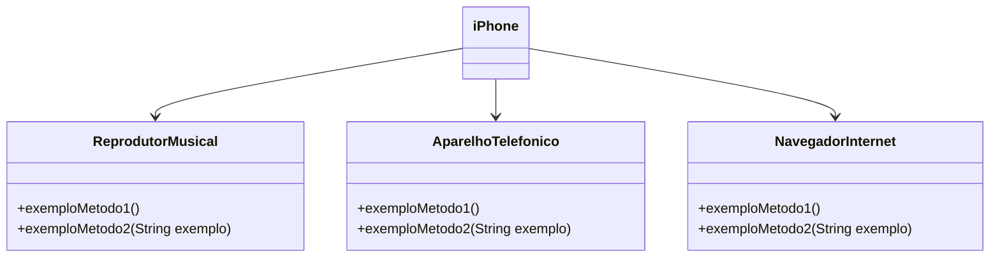

# DIO - Trilha Java Básico
www.dio.me

#### Autores
- [Luiz Cordeiro](https://github.com/luizcordeirosn)

## Sintaxe - Desafio I

Vamos exercitar todo o conteúdo apresentado no módulo de Sintaxe codificando o seguinte cenário.

1. Crie o projeto `ContaBanco` que receberá dados via terminal contendo as características de conta em banco conforme atributos abaixo:
2. Dentro do projeto, crie a classe `ContaTerminal.java` para realizar toda a codificação do nosso programa.

###### Revise sobre regras de declaração de variáveis

| Atributo  | Tipo     | Exemplo   
| --------- | ---------| ------- 
| Numero    | Inteiro  | 1021 
| Agencia   | Texto    | 067-8
| Nome Cliente | Texto    | MARIO ANDRADE
| Saldo | Decimal |237.48


###### Revise sobre terminal, main args e a classe Scanner
2. Permita que os dados sejam inseridos via terminal sendo que o usuário receberá a mensagem de qual informação será solicitada, exemplo:

* Programa: "Por favor, digite o número da Agência !"
* Usuário: 1021 *(depois ENTER para o próximo campo)* 

###### Revise sobre concatenação e classe String com método concat

3. Depois de todas as informações terem sido inseridas, o sistema deverá exibir a seguinte mensagem:

*"Olá [Nome Cliente], obrigado por criar uma conta em nosso banco, sua agência é [Agencia], conta [Numero] e seu saldo [Saldo] já está disponível para saque".*

Os campos em [ ] devem ser alterados pelas informações que forem inseridas pelos usuários.

## Controle de Fluxo - Desafio II

Vamos exercitar todo o conteúdo apresentado no módulo de Controle de Fluxo codificando o seguinte cenário.

O sistema deverá receber dois parâmetros via terminal que representarão dois números inteiros, com estes dois números você deverá obter a quantidade de interações (for) e realizar a impressão no console (System.out.print) dos números incrementados, exemplo:

* Se você passar os números 12 e 30, logo teremos uma interação (for) com 18 ocorrências para imprimir os números, exemplo: `"Imprimindo o número 1"`, `"Imprimindo o número 2"` e assim por diante.
* Se o primeiro parâmetro for MAIOR que o segundo parâmetro, você deverá lançar a exceção customizada chamada de `ParametrosInvalidosException` com a segunda mensagem: "O segundo parâmetro deve ser maior que o primeiro"   


1. Crie o projeto `DesafioControleFluxo`
2. Dentro do projeto, crie a classe `Contador.java` para realizar toda a codificação do nosso programa.
3. Dentro do projeto, crie a classe `ParametrosInvalidosException` que representará a exceção de negócio no sistema. 

Abaixo temos um trecho de código no qual você poderá seguir alterando as partes que contenham `??`

```java
public class Contador {
	public static void main(String[] args) {
		Scanner terminal = new Scanner(System.in);
		System.out.println("Digite o primeiro parâmetro");
		int parametroUm = terminal.??;
		System.out.println("Digite o segundo parâmetro");
		int parametroDois = terminal.??;
		
		try {
			//chamando o método contendo a lógica de contagem
			contar(parametroUm, parametroDois);
		
		}catch (? exception) {
			//imprimir a mensagem: O segundo parâmetro deve ser maior que o primeiro
		}
		
	}
	static void contar(int parametroUm, int parametroDois ) throws ParametrosInvalidosException {
		//validar se parametroUm é MAIOR que parametroDois e lançar a exceção
		
		int contagem = parametroDois - parametroUm;
		//realizar o for para imprimir os números com base na variável contagem
	}
}
```

## POO - Desafio III

### Modelagem e Diagramação de um Componente iPhone

Neste desafio, você será responsável por modelar e diagramar a representação UML do componente iPhone, abrangendo suas funcionalidades como Reprodutor Musical, Aparelho Telefônico e Navegador na Internet.

#### Contexto
Com base no vídeo de lançamento do iPhone de 2007 (link abaixo), você deve elaborar a diagramação das classes e interfaces utilizando uma ferramenta UML de sua preferência. Em seguida, implemente as classes e interfaces no formato de arquivos `.java`.

[Lançamento iPhone 2007](https://www.youtube.com/watch?v=9ou608QQRq8)
- Minutos relevantes: 00:15 até 00:55

#### Funcionalidades a Modelar
1. **Reprodutor Musical**
   - Métodos: `tocar()`, `pausar()`, `selecionarMusica(String musica)`
2. **Aparelho Telefônico**
   - Métodos: `ligar(String numero)`, `atender()`, `iniciarCorreioVoz()`
3. **Navegador na Internet**
   - Métodos: `exibirPagina(String url)`, `adicionarNovaAba()`, `atualizarPagina()`

### Objetivo
1. Criar um diagrama UML que represente as funcionalidades descritas acima.
2. Implementar as classes e interfaces correspondentes em Java (Opcional).

### Exemplo de Diagrama UML (Mermaid)


### Instruções
1. Assista ao vídeo do lançamento do iPhone para entender as funcionalidades principais.
2. Utilize uma ferramenta UML de sua preferência para criar o diagrama das classes e interfaces. Você pode utilizar o modelo acima (criado na sintaxe [Mermaid](https://mermaid.js.org/)), uma alternativa open-source e compatível com arquivos Markdown como este.
3. Opcionalmente, caso esteja cheio(a) de confiança, pode implementar as classes Java representadas em seu diagrama UML.
4. Submeta seu repositório GitHub conforme as orientações da plataforma DIO. Por exemplo:

```bash
https://github.com/glysns/trilha-java-basico/desafios/poo/README.md
````

## Criando um Banco Digital com Java e Orientação a Objetos - Desafio IV

Desafio: Considerando nosso conhecimento no domínio bancário, iremos abstrair uma solução Orientada a Objetos em Java. Para isso, vamos interpretar o seguinte cenário:
“Um banco oferece aos seus clientes dois tipos de contas (corrente e poupança), as quais possuem as funcionalidades de depósito, saque e transferência (entre contas da própria instituição).”

#### Abstração
Habilidade de concentrar-se nos aspectos essenciais de um domínio, ignorando características menos importantes ou acidentais. Nesse contexto, objetos são abstrações de entidades existentes no domínio em questão.

#### Encapsulamento
Encapsular significa esconder a implementação dos objetos, criando assim interfaces de uso mais concisas e fáceis de usar/entender. O encapsulamento favorece principalmente dois aspectos de um sistema: a manutenção e a evolução.

#### Herança
Permite que você defina uma classe filha que reutiliza (herda), estende ou modifica o comportamento de uma classe pai. A classe cujos membros são herdados é chamada de classe base. A classe que herda os membros da classe base é chamada de classe derivada.

#### Polimorfismo
Capacidade de um objeto poder ser referenciado de várias formas, ou seja, é capacidade de tratar objetos criados a partir das classes específicas como objetos de uma classe genérica. Cuidado, polimorfismo não quer dizer que o objeto fica se transformando, muito pelo contrário, um objeto nasce de um tipo e morre daquele tipo, o que pode mudar é a maneira como nos referimos a ele.

<h2> Aprenda na Prática Programação Orientada a Objetos - Desafio V</h2>

<p align="center"> 📜 <a href="https://academiapme-my.sharepoint.com/:p:/g/personal/camila_cavalcante_dio_me/EaXyYOjBaFpZjkxhexMo5EcBKMEEAI5t5aHlsTjnBQJlUw?e=nxdB6C"> SLIDES APRESENTADO NO PROJETO </a> 📜 </P>
<p> Sejam bem-vindos ao desafio: <strong>APRENDENDO NA PRÁTICA O PARADIGMA DE ORIENTAÇÃO A OBJETOS.</strong><br>Desafio este que tive a honra de co-criar com a plataforma de cursos online <strong><a href="https://web.digitalinnovation.one/">DIGITAL INNOVATION ONE</a></strong> 💛🧡 e disponibilizado de forma gratuita para a comunidade dos desenvolvedores Java.<br>
    💎 O objetivo principal é colocar em prática umas das principais ferramentas da OO: <strong>ABSTRAÇÃO, ENCAPSULAMENTO, HERANÇA E POLIMORFISMO,</strong> através de um projeto Java. </p>


<h2>🛑 Pré-Requisitos</h2>

<p>
✅ Conhecer a sintaxe da Java<br>
✅ Java JDK 11<br>
✅ IDE para desenvolvimento Java (usarei IntelliJ)<br>
✅ Git<br>
✅ Conta no GitHub<br>
</p>


<h2> 👣 Passo-a-Passo</h2>

<p>
<strong>	1.</strong> Vamos ABSTRAIR o DOMÍNIO Bootcamp e MODELAR seus ATRIBUTOS E MÉTODOS <br>
<strong>	2.</strong> Criaremos as CLASSES: Bootcamp, Cursos, Mentorias e Devs e vamos relaciona-las <br>
<strong>	3.</strong> As CLASSES Curso, Mentoria e Devs também serão MODELADOS, ou seja, criaremos seus ATRIBUTOS E MÉTODOS <br> 
<strong>	4.</strong> Para que o código fique mais legível e de fácil manutenção, iremos utilizar de algumas das ferramentas que o PARADIGMA DE ORIENTAÇÃO A OBJETOS (POO) nos oferece: ABSTRAÇÃO, ENCAPSULAMENTO, HERANÇA E POLIMORFISMO <br>
<strong>	5.</strong> E para representar CLASSES que foram criadas e relacionadas, iremos transforma-las em OBJETOS<br>
</p>

----

<h2> 📚 Paradigma de Programação Orientado a Objetos (POO) </h2>

<p>
A visão de Orientação a Objetos (OO) é aquela de um mundo de objetos que interagem.<br>
Este paradigma é um modelo de análise, projeto e programação baseado na aproximação entre o mundo real e o mundo virtual, através da criação e interação entre classes, atributos, métodos, objetos, entre outros.<br>
São 4 os pilares principais do POO: ABSTRAÇÃO, ENCAPSULAMENTO, HERANÇA E POLIMORFISMO. 
</p>


<h3>🔺 ABSTRAÇÃO:</h3>

<p>
Habilidade de concentrar-se nos aspectos essenciais de um domínio, ignorando características menos importantes ou acidentais. Nesse contexto, objetos são abstrações de entidades existentes no domínio em questão.</p>

<h3>🔺 ENCAPSULAMENTO:</h3>

<p> Encapsular significa esconder a implementação dos objetos. O encapsulamento favorece principalmente dois aspectos de um sistema: a manutenção e a evolução.</p>

<h3>🔺 HERANÇA:</h3>

<p>Permite que você defina uma classe filha que reutiliza (herda), estende ou modifica o comportamento de uma classe pai. A classe cujos membros são herdados é chamada de classe base. A classe que herda os membros da classe base é chamada de classe derivada.</p>

<h3> 🔺 POLIMORFISMO:</h3>

<p>Capacidade de um objeto poder ser referenciado de várias formas. Cuidado, polimorfismo não quer dizer que o objeto fica se transformando, muito pelo contrário, um objeto nasce de um tipo e morre daquele tipo, o que pode mudar é a maneira como nos referimos a ele. A capacidade de tratar objetos criados a partir das classes específicas como objetos de uma classe genérica é chamada de polimorfismo.</p>
<br>
<h2 align="center"> ‼️ CONCEITOS FUNDAMENTAIS POO ‼️ </h2>
<p>
<h3>🔻 DOMÍNIO:</h3> 
Domínio da aplicação, também conhecida como camada de negócio ou de objetos de negócio, é aquela onde estão localizadas as classes que fazem parte do domínio do problema, ou seja, classes correspondentes a objetos que fazem parte da descrição do problema.

<h3>🔻 CLASSE: </h3> 
Um elemento do código que tem a função de representar objetos do mundo real. Dentro dela é comum declararmos atributos e métodos, que representam, respectivamente, as características e comportamentos desse objeto.

<h3>🔻 ATRIBUTO: </h3>
Atributos são, basicamente, a estrutura de dados que vai representar a classe. Os atributos também são conhecidos como VARIÁVEL DE CLASSE, e podem ser divididos em dois tipos básicos: atributos de instância e de classe. 

<h3>🔻 VARIÁVEL: </h3>
Uma “região de memória (do computador) previamente identificada cuja finalidade é armazenar os dados ou informações de um programa por um determinado espaço de tempo”.

<h3>🔻 MÉTODO: </h3>
Os métodos representam os estados e ações dos objetos e classes.

<h3>🔻 OBJETO: </h3>
Em POO, objeto é um "molde" de uma determinada classe, que passa a existir a partir de uma instância da classe. A classe define o comportamento do objeto, usando atributos (propriedades) e métodos (ações).
Objeto em ciência da computação, é uma referência a um local da memória que possui um valor. Um objeto pode ser uma variável, função, ou estrutura de dados. 

<h3>🔻 INSTÂNCIA: </h3>
Uma instância de uma classe é um novo objeto criado dessa classe, com o operador new. Instanciar uma classe é criar um novo objeto do mesmo tipo dessa classe. Uma classe somente poderá ser utilizada após ser instanciada.

</p>
    
------------
<br>

<h2> 🧮 Linguagem de Programação vs Paradigma de Linguagem de Programação</h2>

<p>
<h3> ✨ LINGUAGEM DE PROGRAMAÇÃO:</h3> 
É uma linguagem formal que, através de uma série de instruções, permite que um programador escreva um conjunto de ordens, ações consecutivas, dados e algoritmos para criar programas que controlam o comportamento físico e lógico de uma máquina.<br>
Seguem alguns exemplos de como as linguagens de programação podem ser classificadas:<br>
<br>
🔺 Nível de abstração:<br>
Baixo Nível: Assembly<br>
Médio Nível: C, C++, D, Objective C, etc.<br>
Alto Nível: Java, C#, PHP, Javascript, etc.<br>
Altíssimo Nível: Python, Ruby, Elixir, etc.<br>
<br>
🔺 Paradigma de programação:<br>
Programação Estruturada: C, Pascal, Ada, etc.<br>
Programação Orientada a Objetos: Java, C#, C++, Objective C, D, etc.<br>
Programação Funcional: Lisp, Scheme, Erlang, Elixir, etc.<br>
<br>
🔺 Linguagens classificadas pela arquitetura da aplicação:<br>
Desktop: C, C++, Object Pascal, Java, etc.<br>
Web: PHP, Ruby, Javascript, Java, etc.<br>
<br>
🔺 Tipo de execução:<br>
Linguagens compiladas: C, C++, Pascal, D, GO, etc.<br>
Linguagens Interpretadas: Python, Ruby, PHP, Javascript, etc.<br>
Linguagens Hibridas: Java, Erlang, Elixir, etc.<br>


<h3> ✨ PARADIGMA DE LINGUAGEM DE PROGRAMAÇÃO</h3> 

É um conjunto de características que podem ser utilizados para categorizar determinado grupo de linguagens. Um paradigma pode oferecer técnicas apropriadas para uma aplicação específica.<br>
<br>
<strong>PARADIGMAS PRINCIPAIS e SEUS SUBPARADIGMAS</strong><br>

🔸 <strong>1. Paradigma Imperativo</strong><br>
Neste paradigma, o programa descreve o processamento necessário para solucionar o problema. Assim, o paradigma imperativo é caracterizado por execução sequencial de instruções, pelo uso de variáveis que representam posições de memória e pelo uso de instruções de atribuição que alteram os valores dessas variáveis.<br>
Vejamos alguns Subparadigmas do Paradigma Imperativo e exemplos linguagens de programação que adotam esses subparadigmas.<br>
<br>
🔸  1.1 Paradigma estruturado:  ALGOL 58 e ALGOL 60 <br>
🔸  1.2 Paradigma concorrente: Java e Ada<br>
🔸  1.3 Paradigma Orientado a Objetos: Smalltalk e Java<br>
<br>
🔹 <strong>2. Paradigma Declarativo</strong><br>
Este paradigma é o modelo no qual os resultados são descritos, mas os passos para chegar aos resultados não são estabelecidos.<br>
Vejamos alguns Subparadigmas do Paradigma Declarativo e exemplos linguagens de programação que adotam esses subparadigmas:<br>
<br>
🔹 2.1 Paradigma Funcional: Lisp e Haskell<br>
🔹 2.2 Paradigma Lógico: Prolog<br>
</p>

<h2> 🤝 Contribuindo </h2>

<p>
Este repositório foi criado para fins de estudo, então contribua com ele.<br>
Se te ajudei de alguma forma, ficarei feliz em saber. E caso você conheça alguém que se identidique com o conteúdo, não deixe de compatilhar.<br>
<br>
Se possível:<br>
⭐️  Star o projeto<br>
🐛 Encontrar e relatar issues<br>
</p>


------------
